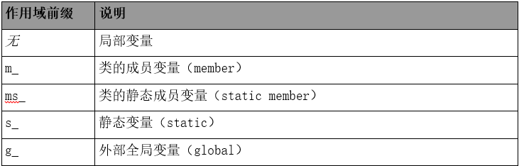
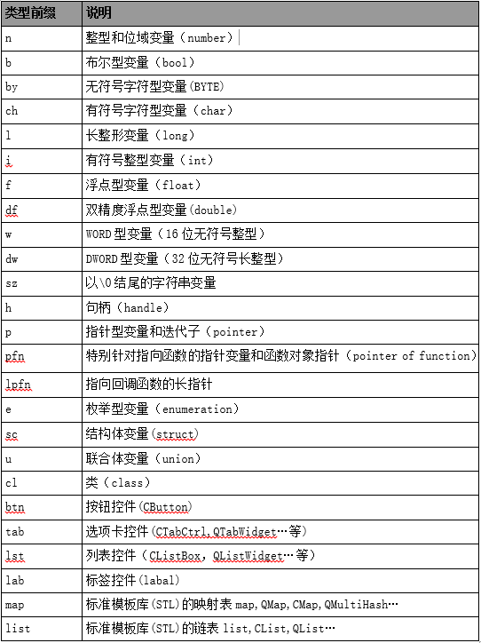

3. 标识符命名
===============

3-1：标识符的命名要清晰、明了，有明确含义，同时使用完整的单词或大家基本可以理解的缩写，避免使人产生误解。 
为使程序可读性更强，应该使用匈牙利命名法；一般情况下，用匈牙利命名法为变量取名的方式为：<scope_>+<prefix_>+<qualifier>。即范围前缀_+类型前缀_+限定词。其中范围前缀和类型前缀有一定的格式，在下面我们给出这两种前缀的限定字符：

**作用域前缀** 标明一个变量的可见范围。作用域可以有如下几种： 

.. attention:: 

    除非不得已，否则应该尽可能少使用全局变量。

a 类型前缀可以组合使用，例如"gc"表示字符数组，"ppn"表示指向整型的指针的指针等等。
b 整型变量一般情况下都使用n表示。但是当为了特别区分有/无符号整型时，应该使用n表示无符号整型，i表示有符号整型；要特别区分变量长度时可以使用n32、l64等表示。
c 对于浮点型变量，一般情况下使用f表示。但是当为了特别区分单精度浮点型与双精度浮点型的区别时要使用f、df分别表示。

变量的名字应当使用“名词”或“形容词+名词”。例如："nCode", "m_nState"，"nMaxWidth" ....

**类型前缀** 标明一个变量的类型，可以有如下几种：

3-2：命名中若使用特殊约定或缩写，则要有注释说明。 

**说明：** 应该在源文件的开始之处，对文件中所使用的缩写或约定，特别是特殊的缩写，进行必要的注释说明。 

3-3：自己特有的命名风格，要自始至终保持一致，不可来回变化。 

**说明：** 个人的命名风格，在符合所在项目组或产品组的命名规则的前提下，才可使用。 （即命名规则中没有规定到的地方才可有个人命名风格） 。 

3-4：对于变量命名，禁止取单个字符（如i、j、k...），建议除了要有具体含义外，还能表明其变量类型、数据类型等，但i、j、k作局部循环变量是允许的。 

**说明：**变量，尤其是局部变量，如果用单个字符表示，很容易敲错（如 i 写成 j） ，而编译时又检查不出来，有可能为了这个小小的错误而花费大量的查错时间。 

**示例：** 下面所示的局部变量名的定义方法可以借鉴。 

::

    int i_Width 
    其变量名解释如下： 
    i      数据类型（Interger） 
    Width  变量含义
    这样可以防止局部变量与全局变量重名。 

3-5：命名规范必须与所使用的系统风格保持一致，并在同一项目中统一，比如采用UNIX的全小写加下划线的风格或大小写混排的方式，不要使用大小写与下划线混排的方式，用作特殊标识如标识成员变量或全局变量的m_和g_，其后加上大小写混排的方式是允许的。 

**示例：**  Add_User 不允许，add_user、AddUser、m_AddUser 允许。  

3-6：除非必要，不要用数字或较奇怪的字符来定义标识符。 

**示例：** 如下命名，使人产生疑惑。 

.. code-block:: c

    #define _EXAMPLE_0_TEST_ 
    #define _EXAMPLE_1_TEST_ 
    void set_sls00( BYTE sls ); 
 
应改为有意义的单词命名

.. code-block:: c

    #define _EXAMPLE_UNIT_TEST_ 
    #define _EXAMPLE_ASSERT_TEST_ 
    void set_udt_msg_sls( BYTE sls ); 

3-7：在同一软件产品内，应规划好接口部分标识符（变量、结构、函数及常量）的命名，防止编译、链接时产生冲突。 

**说明：** 对接口部分的标识符应该有更严格限制，防止冲突。如可规定接口部分的变量与常量之前加上“模块”标识等。 

3-8：用正确的反义词组命名具有互斥意义的变量或相反动作的函数等。 

**说明：** 下面是一些在软件中常用的反义词组。 

::

    add / remove       begin / end        create / destroy  
    insert / delete    first / last       get / release 
    increment / decrement                 put / get 
    add / delete       lock / unlock      open / close 
    min / max          old / new          start / stop 
    next / previous    source / target    show / hide 
    send / receive     source / destination 
    cut / paste        up / down 

示例： 

.. code-block:: c 

    int  min_sum; 
    int  max_sum; 
    int  add_user( BYTE *user_name ); 
    int  delete_user( BYTE *user_name );

3-9：除了编译开关/头文件等特殊应用，应避免使用_EXAMPLE_TEST_之类以下划线开始和结尾的定义。
