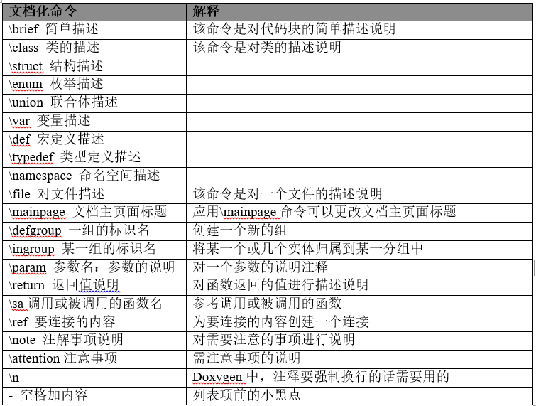

2. 注释
=========

通则
~~~~~~~

2-1：一般情况下，源程序有效注释量必须在20％以上。 

**说明：** 注释的原则是有助于对程序的阅读理解，在该加的地方都加了，注释不宜太多也不能太少，注释语言必须准确、易懂、简洁。 

2-2：边写代码边注释，修改代码同时修改相应的注释，以保证注释与代码的一致性。不再有用的注释要删除。 

2-3：注释的内容要清楚、明了，含义准确，防止注释二义性。 

**说明：** 错误的注释不但无益反而有害。

2-4：避免在注释中使用缩写，特别是“非”常用缩写。 

**说明：** 在使用缩写时或之前，应对缩写进行必要的说明。

2-5：对变量的定义和分支语句（条件分支、循环语句等）必须编写注释。 

**说明：** 这些语句往往是程序实现某一特定功能的关键，对于维护人员来说，良好的注释帮助更好的理解程序，有时甚至优于看设计文档。 

2-6：对于 ``switch`` 语句下的 ``case`` 语句，如果因为特殊情况需要处理完一个 ``case`` 后进入下一个 ``case`` 处理，必须在该 ``case`` 语句处理完、下一个 ``case`` 语句前加上明确的注释， ``switch``  块中必须有 ``default``  语句。 

**说明：** 这样比较清楚程序编写者的意图，有效防止无故遗漏 ``break`` 语句。 

**示例** （注意斜体加粗部分） ： 

.. code-block:: c

    default:
        break;
    case CMD_UP:    
        ProcessUp();  
        break; 
    
    case CMD_DOWN:  
        ProcessDown();  
        break; 
    
    case CMD_FWD:   
        ProcessFwd();  
        
    if (...) 
    { 
        ... 
        break; 
    } 
    else 
    { 
        ProcessCFW_B();   // *now jump into case CMD_A* 
    } 
    
    case CMD_A:     
        ProcessA();     
        break; 
    
    case CMD_B:     
        ProcessB();     
        break; 
    
    case CMD_C:     
        ProcessC();     
        break; 
    
    case CMD_D:     
        ProcessD();     
        break; 
    ... 

2-7：避免在一行代码或表达式的中间插入注释。 

**说明：** 除非必要，不应在代码或表达中间插入注释，否则容易使代码可理解性变差。 

2-8：通过对函数或过程、变量、结构等正确的命名以及合理地组织代码的结构，使代码成为自注释的。 

**说明：** 清晰准确的函数、变量等的命名，可增加代码可读性，并减少不必要的注释。 

2-9：在代码的功能、意图层次上进行注释，提供有用、额外的信息。 

**说明：** 注释的目的是解释代码的目的、功能和采用的方法，提供代码以外的信息，帮助读者理解代码，防止没必要的重复注释信息。 

**示例：** 

如下注释意义不大。 

.. code-block:: c

    /* if receive_flag is TRUE */ 
    if (receive_flag) 
 
而如下的注释则给出了额外有用的信息。  

.. code-block:: c

    /* if mtp receive a message from links */ 
    if (receive_flag) 

2-10: 调试、测试或者其他有专用、临时用途的代码必须用固定格式的注释包围，在正式发布代码的时候，删除这些代码。

.. code-block:: c

    在程序中有测试的代码 一定要用 
    //TEST
    …..测试代码
    //==

    //DEBUG
    ….调试代码
    //==

    //TODO
    ….. 函数功能还不完整，需要补充
    //==

    //NOTE
    …. 这段代码可能在什么情况出问题
    //==

这样，只要搜索一下发布的代码中的 ``//==`` ，即知道有哪些是测试，哪些未完成，哪些是有问题的,并根据具体情况删除或修改这些代码。

格式
~~~~~~~

2-11：注释格式尽量统一。

::

    文档化注释：
    单行注释，在注释对象的上方使用 ///
    单行注释，在注释对象的右方使用 ///<

    多行注释 只使用 
    /*!

    */
    非文档化注释：
    单行注释，在注释对象的上方使用 //
    单行注释，在注释对象的右方使用 //

    多行注释 只使用 
    /*

    */

2-12：注释应考虑程序易读及外观排版的因素，使用的语言若是中、英兼有的，建议多使用中文，除非能用非常流利准确的英文表达。 

**说明：** 注释语言不统一，影响程序易读性和外观排版，出于对维护人员的考虑，建议使用中文。 

2-13：文档化注释必须按照规定的格式编写，以便使用Doxygen自动生成文档。

**说明：** 为了能使用Doxygen自动为项目生成文档，这就要求编写注释必须使用规定的格式；同时要达到某种显示效果还需要配合使用一些Doxygen中常用的指令，下表列举了Doxygen中常用的指令及说明：

更详细的说明，请参考Doxygen的官方文档。

Doxygen支持多种注释风格，在我公司文档化代码注释要求使用Qt风格的注释，即：

.. code-block:: c

    /*!
    ......描述......
    */
    若是单行注释，在注释代码块上部的使用，三个斜杠加一个空格加注释内容 
    /// 注释内容描述
    在代码右边注释使用，注释标识符和注释内容之间有一个空格。
    ///< 注释内容描述
    在不需要文档化显示的代码注释允许使用”//…”或/*…*/注释。

2-13-1：文件（如头文件 ``.h`` 文件、 ``.inc`` 文件、 ``.def`` 文件、编译说明文件 ``.cfg`` 等）头部应进行注释，注释必须列出：版权说明、版本号、生成日期、作者、内容、功能、与其它文件的关系、修改日志等，头文件的注释中还应有函数功能简要说明。 

**示例：** 下面这段头文件的头注释比较标准，当然，并不局限于此格式，但上述信息建议要包含在内。

.. code-block:: c

    /*!********************************************************************
    创建日期: 2010/08/03
    文件名称: connection.cpp
    作者    :	 陶思良 Leo@rcdevice.com
    版权所有: 北京凯模创新科技有限公司 2009-2010
                www.rcdevice.com

    文件描述:
    这个文件是虚拟总线通讯驱动的一部分，这个库使用TCP/IP网络来模拟物理总线

    这个驱动是以DLL的形式提供,并且这个dll只给QT框架的应用程序调用

    收发数据的部分是在驱动中以单独的线程实现的,调用者不用考虑数据读写冲突
    \-----------------------------------------------------------------\
    修改记录：
    日 期        版本     修改人              修改内容
    YYYY/MM/DD   X.Y      <作者或修改者名>    <修改内容>
    ***********************************************************************/

2-13-2：函数头部应进行注释，列出：函数的目的/功能、输入参数、输出参数、返回值、等。 

**示例：** 下面这段函数的注释比较标准，当然，并不局限于此格式，但上述信息建议要包含在内。

.. code-block:: c

    /*！
    \brief 本函数实现的功能简介
    \param[in] 参数名1  参数1说明
    \param[out] 参数名2  参数2说明
    \return 返回值说明
    \note 需注意的事项

    详细说明：函数的功能、性能等描述

    其它说明：
    */ 

.. attention::

    如果 ``\param`` 命令后的 ``[in]/[out]`` 是表示该参数的传递方向，既表示是输入/输出参数。可以省略。在某些情况下，参数或返回值的情况是几种确定的情况，可以将这几种情况用 ``-``  符号加一个空格列出来，在转换成Doxygen文档的时候，这些 ``-`` 符号就会变成小黑点。

例如：

.. code-block:: c

    /*!
    * A list of events:
    *   - mouse events
    *     -# mouse move event
    *     -# mouse click event\n
    *        More info about the click event.
    *     -# mouse double click event
    *  - keyboard events
    *     -# key down event
    *     -# key up event
    *
    * More text here.
    */

文档编译以后的结果是下列的样子：
::

    A list of events:
    • mouse events
    1. mouse move event
    2. mouse click event
    More info about the clic
    3. mouse double click eve
    • keyboard events
    1. key down event
    2. key up event

    More text here.

2-13-3：类头部应进行注释，注释应该说明该类的功能等

**示例：** 下面这段函数的注释比较标准，当然，并不局限于此格式，但上述信息建议要包含在内。

.. code-block:: c

    /*！
    \class 类名
    \brief 本类实现的功能简介
    详细说明：该类的功能、性能等描述

    \sa 参见类
    其它说明：
    */ 

2-13-4：其他特殊注释块说明：

定义一个模块可以使用如下格式代码：

.. code-block:: c

    /*！
    \defgroup 模块名 模块的说明文字
    @{
    */
    … 定义的内容 …
    /** @} */    模块结尾

        如果要加入把一些注释加入到某一个模块中，应使用如下代码格式：
    /*！
    \ingroup 模块名
    该模块的其他注释信息
    */

    如果在注释中要添加一个链接，可以在要加链接的内容前加\ref命令，如：
    /*!
    \brief 

    注释内容
    在\ref fnA（）函数中调用了……………
    */

	使用\mainpage指令可参考Doxygen 的官方文档。

2-14：全局变量要有较详细的注释，包括对其功能、取值范围、哪些函数或过程存取它以及存取时注意事项等的说明。 

**示例：**

.. code-block:: c

    /* The ErrorCode when SCCP translate */ 
    /* Global Title failure, as follows */      // 变量作用、含义 
    /* 0 － SUCCESS   1 － GT Table error */ 
    /* 2 － GT error  Others － no use  */       // 变量取值范围 
    /* only  function  SCCPTranslate() in */ 
    /* this modual can modify it,  and  other */ 
    /* module can visit it through call */ 
    /* the  function GetGTTransErrorCode() */    // 使用方法 
    BYTE g_GTTranErrorCode;   

2-15：文档的编译，在代码的编写过程中，使用Doxygen同步编译文档，编译过程中出现的错误，必须及时纠正，对于文档编译过程中的出现的警告，将视为错误对待，无法处理的警告信息，必须在\manpage文档中申明。

2-16：注释与所描述内容进行同样的缩排。 

**说明：** 可使程序排版整齐，并方便注释的阅读与理解。 

**示例：** 

如下例子，排版不整齐，阅读稍感不方便。 

.. code-block:: c

    void example_fun( void ) 
    { 
    /* code one comments */ 
    CodeBlock One
            /* code two comments */ 
        CodeBlock Two 
    } 
    
以下例子符合规范：

.. code-block:: c

    void example_fun( void ) 
    { 
        /* code one comments */ 
        CodeBlock One 
    
        /* code two comments */ 
        CodeBlock Two 
    } 

2-17：将注释与其上面的代码用空行隔开。 

**示例：** 如下例子，显得代码过于紧凑。 

.. code-block:: c

    /* code one comments */ 
    program code one 
    /* code two comments */ 
    program code two 
 
以下例子符合规范：

.. code-block:: c

    /* code one comments */ 
    program code one 
    
    /* code two comments */ 
    program code two 

2-18：在程序块的结束行右方加注释标记，以表明某程序块的结束。 

**说明：** 当代码段较长，特别是多重嵌套时，这样做可以使代码更清晰，更便于阅读。 

**示例：** 

.. code-block:: c

    if (...) 
    { 
        // program code 
    
        while (index < MAX_INDEX) 
        { 
            // program code 
        } /* end of while (index < MAX_INDEX) */ // 指明该条 while 语句结束 
    } /* end of  if (...)*/ // 指明是哪条 if 语句结束 

位置
~~~~~~~

2-19：注释应与其描述的代码相近，对代码的注释应放在其上方或右方（对单条语句的注释）相邻位置，不可放在下面，如放于上方则需与其上面的代码用空行隔开。

**示例** 

以下例子不符合规范：

.. code-block:: c

    例 1： 
    /* get replicate sub system index and net indicator */ 
    
    
    repssn_ind = ssn_data[index].repssn_index; 
    repssn_ni = ssn_data[index].ni; 
    
    例 2： 
    repssn_ind = ssn_data[index].repssn_index; 
    repssn_ni = ssn_data[index].ni; 
    /* get replicate sub system index and net indicator */ 
    
以下例子符合规范： 

.. code-block:: c

    /* get replicate sub system index and net indicator */ 
    repssn_ind = ssn_data[index].repssn_index; 
    repssn_ni = ssn_data[index].ni; 

2-20：对于所有有物理含义的变量、常量，如果其命名不是充分自注释的，在声明时都必须加以注释，说明其物理含义。变量、常量、宏的注释应放在其上方相邻位置或右方。 

**示例：**

.. code-block:: c 

    /* active statistic task number */ 
    #define MAX_ACT_TASK_NUMBER 1000 
    #define MAX_ACT_TASK_NUMBER 1000 /* active statistic task number */ 

2-21：数据结构声明(包括数组、结构、类、枚举等)，如果其命名不是充分自注释的，必须加以注释。对数据结构的注释应放在其上方相邻位置，不可放在下面；对结构中的每个域的注释放在此域的右方。 

**示例：** 可按如下形式说明枚举/数据/联合结构。

.. code-block:: c 

    /* sccp interface with sccp user primitive message name */ 
    enum  SCCP_USER_PRIMITIVE 
    { 
        N_UNITDATA_IND, /* sccp notify sccp user unit data come */ 
        N_NOTICE_IND,   /* sccp notify user the No.7 network can not */ 
                        /* transmission this message */ 
        N_UNITDATA_REQ, /* sccp user's unit data transmission request*/ 
    };
