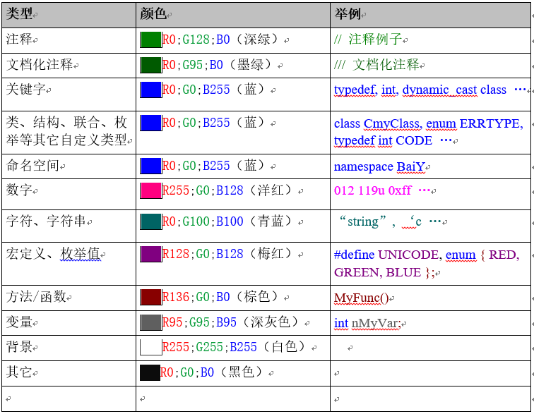

1. 排版
=========

缩进、空格与对齐
~~~~~~~~~~~~~~~~~

1-1：程序块要采用缩进风格编写，缩进的空格数为4个。

**说明：** 对于由开发工具自动生成的代码可以有不一致，请设置这些IDE开发环境的 ``TAB`` size为4个空格，缩进也是4个空格。

1-2：相对独立的程序块之间、变量说明之后必须加空行。

**示例：**

以下例子不符合规范：

.. code-block:: c

    if (!valid_ni(ni)) 
    { 
         ... // program code 
    } 
    repssn_ind = ssn_data[index].repssn_index; 
    repssn_ni  = ssn_data[index].ni; 

以下例子符合规范：

.. code-block:: c

    if (!valid_ni(ni)) 
    { 
        ... // program code 
    } 
    
    repssn_ind = ssn_data[index].repssn_index; 
    repssn_ni  = ssn_data[index].ni; 

1-3：对齐只使用空格键，不使用 ``TAB`` 键。

**说明：** 为避免用不同的编辑器阅读程序时，因 ``TAB`` 键所设置的空格数目不同而造成程序布局不整齐，有些版本编辑器会自动将8个空格变为一个 ``TAB`` 键，因此在开发团队中尽量使用统一的编辑环境。

1-4：函数或过程的开始、结构的定义及循环、判断等语句中的代码都要采用缩进风格， ``case`` 语句下的情况处理语句也要遵从语句缩进要求。

1-5：程序块的分界符（如C/C++语言的大括号 ``{`` 和 ``}`` ）应各独占一行并且位于同一列，同时与引用它们的语句左对齐。在函数体的开始、类的定义、结构的定义、枚举的定义以及 ``if`` 、``for``、``do``、``while``、``switch``、 ``case`` 语句中的程序都要采用如上的缩进方式。

**示例：**

以下例子不符合规范：

.. code-block:: c

    for (...) { 
        ... // program code 
    } 
    
    if (...)  
        { 
        ... // program code 
        } 
    
    void example_fun( void ) 
        { 
        ... // program code 
        }

以下例子符合规范：

.. code-block:: c

    for (...)  
    { 
        ... // program code 
    } 
    
    if (...)  
    { 
        ... // program code 
    } 
    
    void example_fun( void ) 
    { 
        ... // program code 
    }

1-6：在两个以上的关键字、变量、常量进行对等操作时，它们之间的操作符之前、之后或者前后要加空格；进行非对等操作时，如果是关系密切的立即操作符（如 ``－>`` ），后不应加空格。

**说明：**  采用这种松散方式编写代码的目的是使代码更加清晰。 
由于留空格所产生的清晰性是相对的， 所以， 在已经非常清晰的语句中没有必要再留空格，如果语句已足够清晰则括号内侧(即左括号后面和右括号前面)不需要加空格， 多重括号间不必加空格，因为在 C/C++语言中括号已经是最清晰的标志了。 
在长语句中，如果需要加的空格非常多，那么应该保持整体清晰，而在局部不加空格。给操作符留空格时不要连续留两个以上空格。

**示例：**

a 逗号、分号只在后面加空格。

.. code-block:: c

    int a, b, c;

b 比较操作符, 赋值操作符 ``=`` 、 ``+=`` ，算术操作符 ``+`` 、 ``%`` ，逻辑操作符 ``&&`` 、 ``&`` ，位域操作符 ``<<`` 、 ``^`` 等双目操作符的前后加空格。

.. code-block:: c

    if (current_time >= MAX_TIME_VALUE)  
    { 
    a = b + c; 
    a *= 2; 
    a = b ^ 2; 
    } 

c ``!`` 、 ``~`` 、 ``++`` 、 ``--`` 、 ``&`` （地址运算符）等单目操作符前后不加空格。

.. code-block:: c

    *p = 'a';        // 内容操作"*"与内容之间 
    flag = !isEmpty; // 非操作"!"与内容之间 
    p = &mem;        // 地址操作"&" 与内容之间 
    i++;             // "++","--"与内容之间 

d ``->`` 、 ``.`` 前后不加空格。 

.. code-block:: c

    p->id = pid;     // "->"指针前后不加空格

.. tip::

     一行程序以小于80字符为宜，不要写得过长。

行划分
~~~~~~~~

1-7：较长的语句（>80字符）要分成多行书写，长表达式要在低优先级操作符处划分新行，操作符放在新行之首，划分出的新行要进行适当的缩进，使排版整齐，语句可读。

**示例：**

.. code-block:: c

    perm_count_msg.head.len = NO7_TO_STAT_PERM_COUNT_LEN 
                            + STAT_SIZE_PER_FRAM * sizeof( _UL ); 
    
    act_task_table[frame_id * STAT_TASK_CHECK_NUMBER + index].occupied 
                = stat_poi[index].occupied; 
    
    act_task_table[taskno].duration_true_or_false 
                = SYS_get_sccp_statistic_state( stat_item ); 
    
    report_or_not_flag = ((taskno < MAX_ACT_TASK_NUMBER) 
                        && (n7stat_stat_item_valid (stat_item)) 
                        && (act_task_table[taskno].result_data != 0)); 

1-8：循环、判断等语句中若有较长的表达式或语句，则要进行适应的划分，长表达式要在低优先级操作符处划分新行，操作符放在新行之首。

**示例：**

.. code-block:: c

    if ((taskno < max_act_task_number) 
        && (n7stat_stat_item_valid (stat_item))) 
    { 
        ... // program code 
    } 
    
    for (i = 0, j = 0; (i < BufferKeyword[word_index].word_length) 
                        && (j < NewKeyword.word_length); i++, j++) 
    { 
        ... // program code 
    } 
    
    for (i = 0, j = 0;   
        (i < first_word_length) && (j < second_word_length);   
        i++, j++) 
    { 
        ... // program code  
    } 

1-9：若函数或过程中的参数较长，则要进行适当的划分。

**示例：**

.. code-block:: c

    n7stat_str_compare((BYTE *) & stat_object, 
                    (BYTE *) & (act_task_table[taskno].stat_object), 
                    sizeof (_STAT_OBJECT)); 
    
    n7stat_flash_act_duration( stat_item, frame_id *STAT_TASK_CHECK_NUMBER 
                                        + index, stat_object ); 

1-10：不允许把多个短语句写在一行中，即一行只写一条语句。

**示例：**

以下例子不符合规范：

.. code-block:: c

    rect.length = 0;  rect.width = 0; 

以下例子符合规范：

.. code-block:: c

    rect.length = 0; 
    rect.width  = 0; 

1-11： ``if`` 、 ``for`` 、 ``do`` 、 ``while`` 、 ``case`` 、 ``switch`` 、 ``default`` 等语句自占一行，且 ``if`` 、 ``for`` 、 ``do`` 、 ``while`` 等语句的执行语句部分无论多少都要加括号 ``{}`` 。 

**示例：**

以下例子不符合规范：

.. code-block:: c

    if (pUserCR == NULL) return; 

以下例子符合规范：

.. code-block:: c

    if (pUserCR == NULL) 
    { 
        return; 
    } 

.. tip::

    特别是while 语句,即使循环体内没有内容,也要写花括号。

例如下面的代码片段由于作者笔误而多写了一个分号,但编译这样的代码不会报任何错误:

以下例子不符合规范：

.. code-block:: c
  
    while(size-->0); 
    *pbTo++ = *pbFrom++;

以下例子符合规范：

.. code-block:: c

    while((size--)>0) 
    {
    *pbTo++ = *pbFrom++;
    }

当确定while循环体需要用空语句时可以这么写:

.. code-block:: c

    while(*pchTo++ = *pchFrom++) 
    {
    ;
    }
    或者
    while(*pchTo++ = *pchFrom++) 
    {
    NULL;
    }

由于 ``NULL`` 是个合法的C表达式，所以这个程序没有问题。使用 ``NULL`` 的更大好处在于编译程序不会为 ``NULL`` 语句生成任何的代码，因为 ``NULL`` 只是个常量。这样，编译程序接受显式的 ``NULL`` 语句，但把隐式空语句自动地当作错误标出。
在程序中只允许使用一种形式的空语句。

颜色与高亮
~~~~~~~~~~

1-12：排版颜色与语法高亮

几乎所有的现代源码编辑器均不同在程度上支持语法高亮显示的功能。语法高亮显示可以在很大程度上帮助我们方便阅读源代码。 

统一的语法高亮规则不仅能让开发人员望色生意，还可以帮助我们阅读没有 编码规范，或者规范执行很烂的源码。

所有在文档中出现的代码段均必须严格符合下表定义的语法高亮规范。在编辑源码时，应该根据编辑器支持的自定义选项最大限度地满足下表定义的高亮规范。

排版字体
~~~~~~~~

1-13：排版字体

字体规范如下：

    a. 使用等宽字体，由于非等宽字体在对其等方面问题多多，任何情况下，源码都必须使用等宽字体编辑和显示。
    
    b. 推荐字体：
    
        在Windows平台中，Fixedsys字体支持多语言，并且是UNICODE字体，支持世界上几乎所有的文字符号，这对编写中文注释是很方便的。

        **Consolas** 是一种专门为编程人员设计的字体,这一字体的特性是所有字符都具有相同的宽度，除了具备Fixedsys的所有特性外，它还是一个矢量字体集合，具有ClearType优化，可以适合任意尺寸的显示器，字体中o和0,1和l 区别很大，各种符号也很清析，不易引起混淆，是强烈推荐的等宽编程字体。
