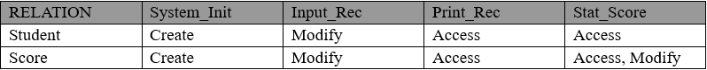
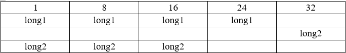

5. 变量、结构
================

5-1：去掉没必要的公共变量。 

**说明：** 公共变量是增大模块间耦合的原因之一，故应减少没必要的公共变量以降低模块间的耦合度。 

5-2：仔细定义并明确公共变量的含义、作用、取值范围及公共变量间的关系。 

**说明：** 在对变量声明的同时，应对其含义、作用及取值范围进行注释说明，同时若有必要还应说明与其它变量的关系。 

5-3：明确公共变量与操作此公共变量的函数或过程的关系，如访问、修改及创建等。 

**说明：** 明确过程操作变量的关系后，将有利于程序的进一步优化、单元测试、系统联调以及代码维护等。这种关系的说明可在注释或文档中描述。 

**示例：** 在源文件中，可按如下注释形式说明。 

.. attention::

    RELATION 为操作关系；System_Init、Input_Rec、Print_Rec、Stat_Score为四个不同的函数；Student、Score 为两个全局变量；Create 表示创建，Modify 表示修改，Access 表示访问。
    
    其中，函数 Input_Rec、Stat_Score 都可修改变量 Score，故此变量将引起函数间较大的耦合，并可能增加代码测试、维护的难度。
    
5-4：当向公共变量传递数据时，要十分小心，防止赋与不合理的值或越界等现象发生。 

**说明：** 对公共变量赋值时，若有必要应进行合法性检查，以提高代码的可靠性、稳定性。 

5-5：防止局部变量与公共变量同名。 

**说明：** 若使用了较好的命名规则，那么此问题可自动消除。 

5-6：严禁使用未经初始化的变量作为右值。 

**说明：** 特别是在 C/C++中引用未经赋值的指针，经常会引起系统崩溃。 

5-7：构造仅有一个模块或函数可以修改、创建，而其余有关模块或函数只访问的公共变量，防止多个不同模块或函数都可以修改、创建同一公共变量的现象。 

**说明：** 降低公共变量耦合度。 

5-8：使用严格形式定义的、可移植的数据类型，尽量不要使用与具体硬件或软件环境关系密切的变量。 

**说明：**使用标准的数据类型，有利于程序的移植。 

**示例：** 如下例子（在 DOS 下 BC3.1 环境中） ，在移植时可能产生问题。

.. code-block:: c 

    void main() 
    { 
        register int index; // 寄存器变量 
    
        _AX = 0x4000; // _AX 是 BC3.1 提供的寄存器“伪变量” 
        ... // program code 
    } 

5-9：结构体(struct)、枚举(enum)、联合体(union)定义格式：
要将定义的结构体、枚举、联合体名放在定义后边，结构体变量前要加S_前缀；枚举变量前要加E_；联合体变量前要加U_。比如：

.. code-block:: c

    typedef struct
    { 
        unsigned char name[8];       /* student's name */ 
        unsigned char age;           /* student's age */ 
        unsigned char sex;           /* student's sex, as follows */ 
                                /* 0 - FEMALE; 1 - MALE */ 
        unsigned char teacher_name[8]; /* the student teacher's name */ 
        unisgned char teacher_sex;     /* his teacher sex */ 
    }S_STUDENT;

    typedef enum
    {
        int max;
        unsigned char arry[8];
    }E_EXAMPLE;

    typedef union 
    {
    int office;
    char teacher[5];
    }U_TEACHER;

5-9：结构的功能要单一，是针对一种事务的抽象。 

**说明：** 设计结构时应力争使结构代表一种现实事务的抽象，而不是同时代表多种。结构中的各元素应代表同一事务的不同侧面，而不应把描述没有关系或关系很弱的不同事务的元素放到同一结构中。 

**示例：** 如下结构不太清晰、合理：

.. code-block:: c

    typedef struct
    { 
        unsigned char name[8];       /* student's name */ 
        unsigned char age;           /* student's age */ 
        unsigned char sex;           /* student's sex, as follows */ 
                                /* 0 - FEMALE; 1 - MALE */ 
        unsigned char teacher_name[8]; /* the student teacher's name */ 
        unisgned char teacher_sex;     /* his teacher sex */ 
    }S_STUDENT; 
    
若改为如下，可能更合理些：

.. code-block:: c

    typedef struct
    { 
        unsigned char name[8]; /* teacher name */ 
        unisgned char sex;     /* teacher sex, as follows */ 
                            /* 0 - FEMALE; 1 - MALE */ 
    }S_TEACHER;

    typedef struct
    { 
        unsigned char name[8];     /* student's name */ 
        unsigned char age;         /* student's age */ 
        unsigned char sex;         /* student's sex, as follows */ 
                                /* 0 - FEMALE; 1 - MALE */ 
        unsigned int  teacher_ind;  /* his teacher index */ 
    }S_STUDENT;

5-10：不要设计面面俱到、非常灵活的数据结构。 

**说明：** 面面俱到、灵活的数据结构反而容易引起误解和操作困难。 

5-11：不同结构间的关系不要过于复杂。 

**说明：** 若两个结构间关系较复杂、密切，那么应合为一个结构。 

**示例：** 如下两个结构的构造不合理。 

.. code-block:: c

    typedef struct
    { 
        unsigned char name[8]; 
        unsigned char addr[40]; 
        unsigned char sex; 
        unsigned char city[15]; 
    }S_PERSON_ONE; 
    
    typedef struct 
    { 
        unsigned char name[8]; 
        unsigned char age; 
        unsigned char tel; 
    }S_PERSON_TWO; 
    
    由于两个结构都是描述同一事物的，那么不如合成一个结构。 
    typedef struct
    { 
        unsigned char name[8]; 
        unsigned char age; 
        unsigned char sex; 
        unsigned char addr[40]; 
        unsigned char city[15]; 
        unsigned char tel; 
    }S_PERSON; 

5-12：结构中元素的个数应适中。若结构中元素个数过多可考虑依据某种原则把元素组成不同的子结构，以减少原结构中元素的个数。 

**说明：** 增加结构的可理解性、可操作性和可维护性。 

**示例：** 假如认为如上的_PERSON 结构元素过多，那么可如下对之划分。 

.. code-block:: c

    typedef struct
    { 
        unsigned char name[8]; 
        unsigned char age; 
        unsigned char sex; 
    }S_PERSON_BASE_INFO; 
    
    typedef struct 
    { 
        unsigned char addr[40]; 
        unsigned char city[15]; 
        unsigned char tel; 
    }S_PERSON_ADDRESS; 
    
    typedef struct
    { 
        PERSON_BASE_INFO person_base; 
        PERSON_ADDRESS person_addr; 
    }S_PERSON; 

5-13：仔细设计结构中元素的布局与排列顺序，使结构容易理解、节省占用空间，并减少引起误用现象。 

**说明：** 合理排列结构中元素顺序，可节省空间并增加可理解性。 

**示例：** 如下结构中的位域排列，将占较大空间，可读性也稍差。 

.. code-block:: c

    typedef struct 
    { 
        unsigned int valid: 1; 
        PERSON person; 
        unsigned int set_flg: 1; 
    }S_EXAMPLE; 
 
若改成如下形式，不仅可节省 1 字节空间，可读性也变好了。

.. code-block:: c

    typedef struct
    { 
        unsigned int valid: 1; 
        unsigned int set_flg: 1; 
        PERSON person ; 
    }S_EXAMPLE; 

5-14：结构的设计要尽量考虑向前兼容和以后的版本升级，并为某些未来可能的应用保留余地（如预留一些空间等）。 

**说明：** 软件向前兼容的特性，是软件产品是否成功的重要标志之一。如果要想使产品具有较好的前向兼容，那么在产品设计之初就应为以后版本升级保留一定余地，并且在产品升级时必须考虑前一版本的各种特性。 

5-15：留心具体语言及编译器处理不同数据类型的原则及有关细节。

**说明：**如在 C 语言中， ``static`` 局部变量将在内存“数据区”中生成，而非 ``static`` 局部变量将在“堆栈”中生成。这些细节对程序质量的保证非常重要。 

5-16：编程时，要注意数据类型的强制转换。

**说明：**当进行数据类型强制转换时，其数据的意义、转换后的取值等都有可能发生变化，而这些细节若考虑不周，就很有可能留下隐患。 

5-17：对编译系统默认的数据类型转换，也要有充分的认识。

**示例：** 如下赋值，多数编译器不产生告警，但值的含义还是稍有变化。 

.. code-block:: c

    char chr; 
    unsigned short int exam; 
    
    chr = -1; 
    exam = chr; // 编译器不产生告警，此时 exam 为 0xFFFF。 

5-18：尽量减少没有必要的数据类型默认转换与强制转换。 

5-19：合理地设计数据并使用自定义数据类型，避免数据间进行不必要的类型转换。 

5-20：对自定义数据类型进行恰当命名，使它成为自描述性的，以提高代码可读性。注意其命名方式在同一产品中的统一。 

**说明：** 使用自定义类型，可以弥补编程语言提供类型少、信息量不足的缺点，并能使程序清晰、简洁。 

**示例：** 可参考如下方式声明自定义数据类型。 
 
下面的声明可使数据类型的使用简洁、明了。 

.. code-block:: c

    typedef unsigned char  BYTE; 
    typedef unsigned short WORD; 
    typedef unsigned int   DWORD; 
 
下面的声明可使数据类型具有更丰富的含义。 

.. code-block:: c

    typedef float DISTANCE; 
    typedef float SCORE; 

5-21：当声明用于分布式环境或不同CPU间通信环境的数据结构时，必须考虑机器的字节顺序、使用的位域及字节对齐等问题 。 

**说明：** 比如 Intel CPU 与 68360 CPU，在处理位域及整数时，其在内存存放的“顺序”正好相反。 

**示例：** 假如有如下短整数及结构。

.. code-block:: c

    unsigned short int exam; 
    typedef struct
    {                       /* Intel 68360 */ 
        unsigned int A1: 1; /* bit  0      7   */ 
        unsigned int A2: 1; /* bit  1      6   */  
        unsigned int A3: 1; /* bit  2      5   */ 
    }S_EXAM_BIT; 
 
如下是 Intel CPU 生成短整数及位域的方式。 

::

    内存： 0          1         2    ...  （从低到高，以字节为单位） 
    exam  exam 低字节  exam 高字节 
    
    内存：        0 bit     1 bit      2 bit    ...  （字节的各“位” ） 
    EXAM_BIT     A1        A2         A3 
    
    如下是 68360 CPU 生成短整数及位域的方式。 
    内存： 0          1         2    ...  （从低到高，以字节为单位） 
    exam  exam 高字节  exam 低字节 
    
    内存：        7 bit     6 bit      5 bit    ...  （字节的各“位” ） 
    EXAM_BIT     A1        A2         A3 
 
**说明：** 在对齐方式下，CPU 的运行效率要快得多。

**示例：** 如下图，当一个 ``long`` 型数（如图中 long1）在内存中的位置正好与内存的字边界对齐时，CPU 存取这个数只需访问一次内存，而当一个 ``long`` 型数（如图中的 long2）在内存中的位置跨越了字边界时，CPU 存取这个数就需要多次访问内存，如 i960cx 访问这样的数需读内存三次（一个 ``BYTE`` 、一个 ``SHORT`` 、一个 ``BYTE`` ，由 CPU 的微代码执行，对软件透明） ，所有对齐方式下 CPU 的运行效率明显快多了。

